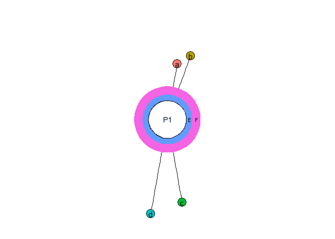
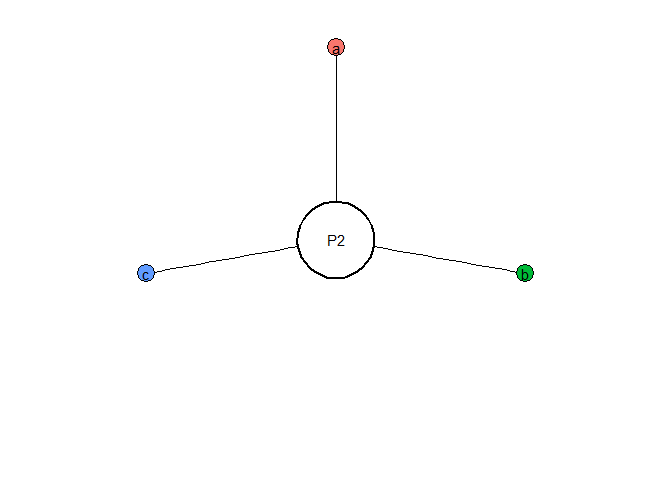
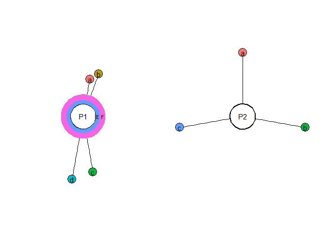

Graphical comparison of research programmes
================

Launch main.R to process all excel files in working_folder into
diagrams. Names on the center of diagrams will be same as on files.

### 1. Read xlsx file with manual test data about label sizes and positions.

``` r
source("Rscripts/RPC_functions.R")
```

``` r
read_excel("test_data/input1.xlsx") -> dataset1
dataset1
```

    ## # A tibble: 6 × 5
    ##   type     label doi   length angle
    ##   <chr>    <chr> <lgl>  <dbl> <dbl>
    ## 1 evidence a     NA       100    10
    ## 2 evidence b     NA       120    20
    ## 3 evidence c     NA       150   170
    ## 4 evidence d     NA       170   190
    ## 5 layer    E     NA        10    NA
    ## 6 layer    F     NA        15    NA

### 2. Plot diagram based on the data:

``` r
plot.curcular.diagram(input = dataset1,
                      programme.name = "P1") -> p1
p1
```

<!-- -->

### 3. Load and plot the data from second file.

``` r
read_excel("test_data/input2.xlsx") -> dataset2

plot.curcular.diagram(input = dataset2,
                      programme.name = "P2") -> p2
p2
```

<!-- -->

### 4. Combine the plots together

``` r
library(patchwork)

p1 + p2
```

<!-- -->
