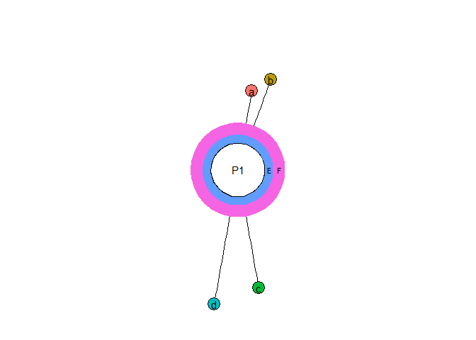
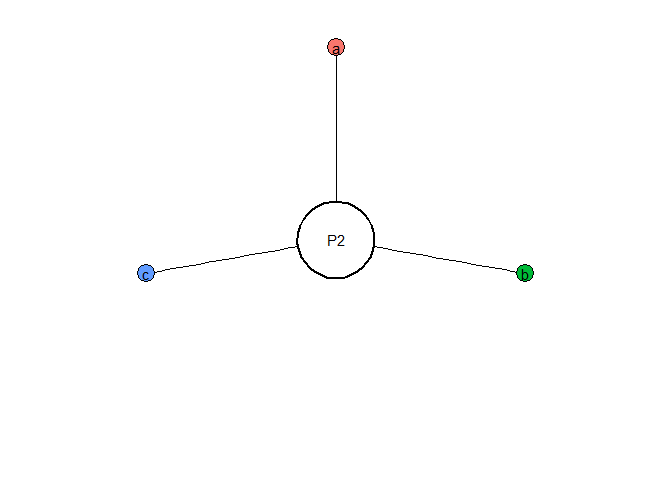
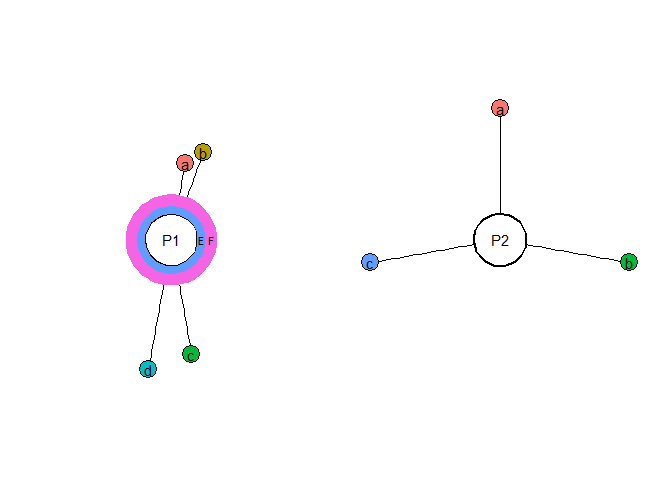

Graphical comparison of research programmes
================

``` r
library(ggplot2)
library(openxlsx)
source("Rscripts/RPC_functions.R")
```

### 1. Read xlsx file with manual test data about label sizes and positions.

``` r
read.xlsx("testdata/input1.xlsx") -> theory1
theory1
```

    ##       type label doi length angle   color
    ## 1 evidence     a  NA    100    10     red
    ## 2 evidence     b  NA    120    20    pink
    ## 3 evidence     c  NA    150   170 #EEFFDD
    ## 4 evidence     d  NA    170   190 #FC35FF
    ## 5    layer     E  NA     10    NA   green
    ## 6    layer     F  NA     15    NA  violet

### 2. Plot diagram based on the data:

``` r
plot.curcular.diagram(input = theory1,
                      programme.name = "P1") -> p1
p1
```

<!-- -->

### 3. Load and plot the data from second file.

``` r
read.xlsx("testdata/input2.xlsx") -> theory2

plot.curcular.diagram(input = theory2,
                      programme.name = "P2") -> p2
p2
```

<!-- -->

### 4. Combine the plots together

``` r
library(patchwork)

p1 + p2
```

<!-- -->
